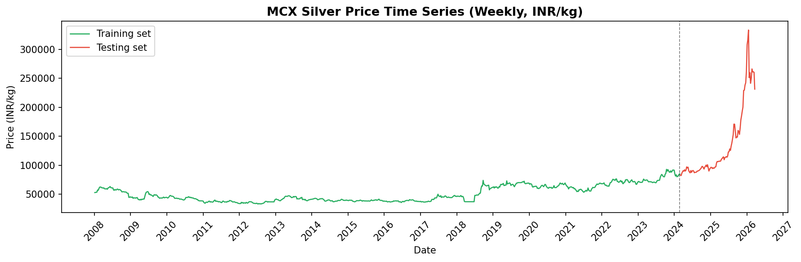
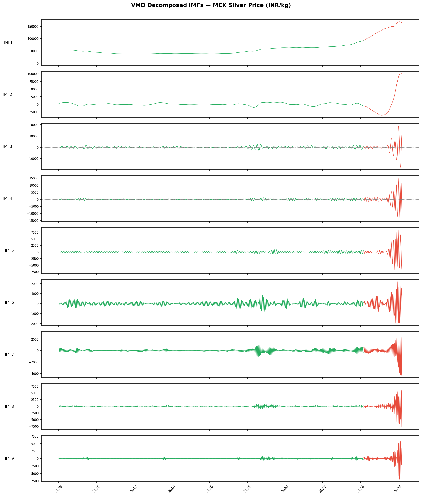
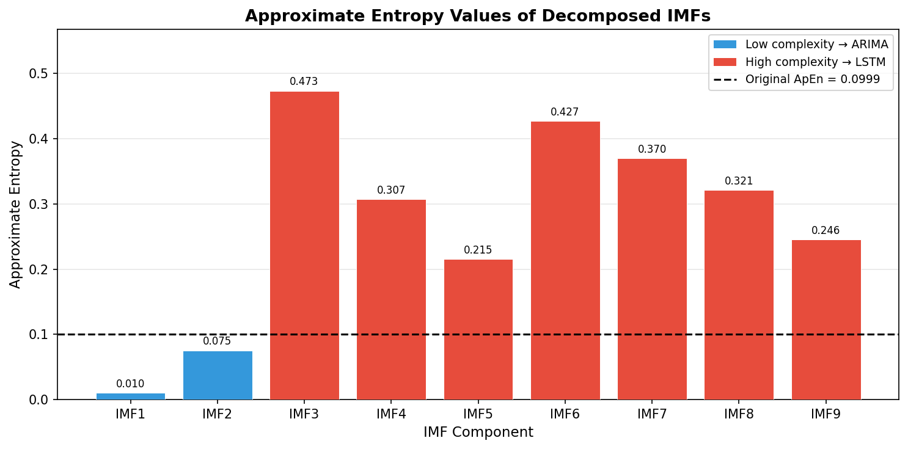
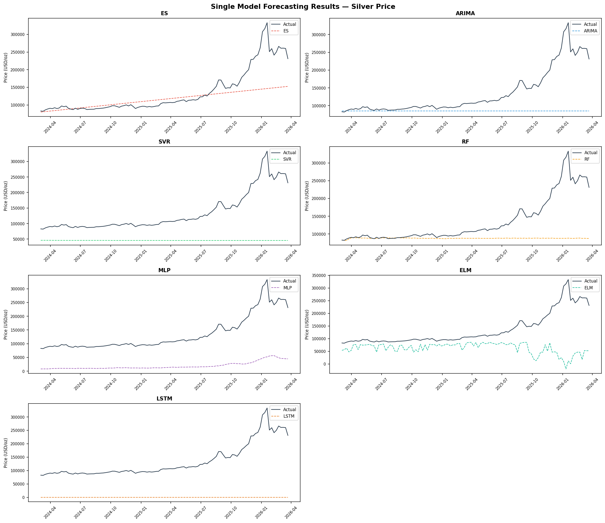
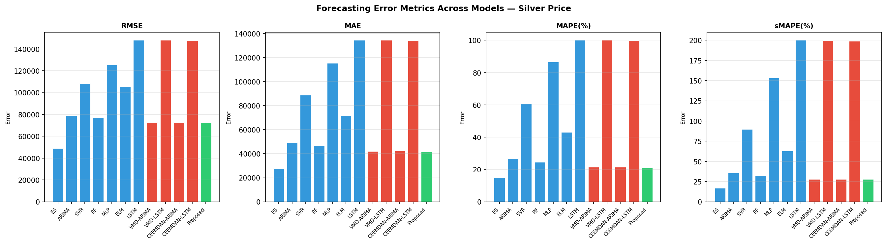
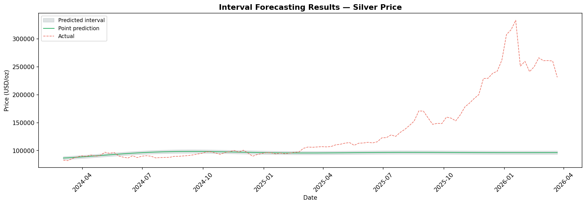
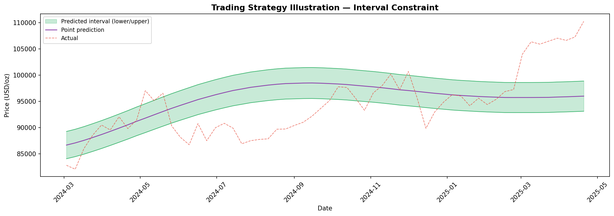
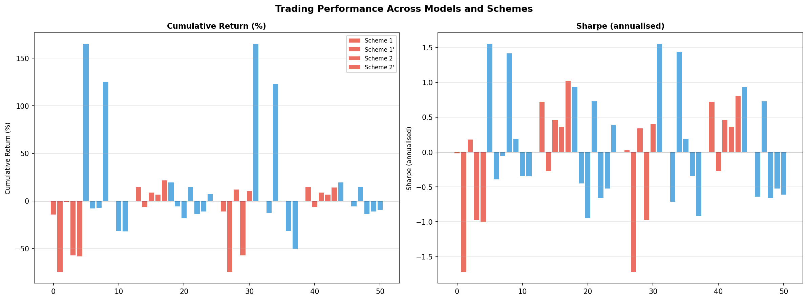

# MCX Silver Price Forecasting — Full Results Report
### VMD-ARIMA-LSTM Hybrid Model | Indian Commodity Market | 2008–2026

---

## What Is This?

This report presents the complete results of a **silver price forecasting study for the Indian commodity market**. The goal is to predict the weekly price of silver traded on the Multi Commodity Exchange of India (MCX) — and then use those predictions to design a rules-based trading strategy.

Silver is one of the most actively traded commodities in India. Its price is influenced by global factors (US dollar, gold prices, geopolitical events) and India-specific factors (rupee exchange rate, import duties, domestic demand). Predicting it accurately is hard because the price signal contains multiple overlapping cycles — short-term noise, medium-term cycles, and long-term trends all layered on top of each other.

**The core idea of this paper:** instead of throwing the raw price series into a single model, decompose it into its component frequencies first, forecast each component with the most appropriate model, then recombine. This is the VMD-ARIMA-LSTM hybrid.

---

## The Problem

**Target variable:** MCX Silver spot price (INR/kg), weekly frequency
**Period:** January 2008 – March 2026 (951 weekly observations)
**Train / Test split:** Training on 843 weeks (Jan 2008 – Feb 2024), testing on 108 weeks (Mar 2024 – Mar 2026)

The test period (Mar 2024 – Mar 2026) was an extraordinary bull market:

| | Train Period | Test Period |
|---|---|---|
| Date range | Jan 2008 – Feb 2024 | Mar 2024 – Mar 2026 |
| Mean price | 50,786 INR/kg | 134,460 INR/kg |
| Std deviation | 14,182 INR/kg | 61,944 INR/kg |
| Trend slope | +39.3 INR/kg/week | +1,652 INR/kg/week |
| **Slope ratio** | — | **42x steeper than training** |

This structural break is the central empirical challenge: models trained on a slow, steady bull market were then evaluated on one of the fastest silver price rallies in Indian market history.

---

## Data Sources

9 weekly time series, all aligned to the same date index (2008–2026):

| Variable | Description | Source | Unit |
|---|---|---|---|
| `mcx_silver` | MCX Silver futures price | Bloomberg (MCXSILV Comdty) | INR/kg |
| `gold_usd` | COMEX Gold futures | Yahoo Finance (GC=F) | USD/oz |
| `brent` | ICE Brent crude oil | Yahoo Finance (BZ=F) | USD/bbl |
| `usdinr` | US Dollar / Indian Rupee | Bloomberg (USDINR REGN) | INR per USD |
| `nifty50` | NSE Nifty 50 index | Bloomberg (NIFTY Index) | Index points |
| `vix_india` | India Volatility Index | Bloomberg (INVIXN Index) | Index |
| `mcx_gold` | MCX Gold futures | Bloomberg (MCXGOLD Comdty) | INR/10g |
| `geo_risk` | Geopolitical Risk Index | Bloomberg (GPRXGPRD Index) | Index |
| `trends_raw` | Google Trends (12 India silver keywords) | Google Trends API | 0–100 |

All external features are **lagged by 1 week** before use in models — this prevents any look-ahead bias (we only use information available before the week we are predicting).


*Figure 4: MCX Silver weekly price (INR/kg). Green = training set (2008–2024), Red = test set (2024–2026). The vertical dashed line marks the train/test boundary.*

---

## Methodology

The pipeline has 6 steps:

```
Raw Price Series
      |
   [Step 1] VMD Decomposition
      |  → 9 IMFs (oscillatory components)
      |
   [Step 2] Approximate Entropy
      |  → Classify each IMF: Low complexity / High complexity
      |
   [Step 3] LASSO Feature Selection
      |  → Select which of the 13 features matter for each IMF
      |
   [Step 4] Hybrid Forecasting
      |  → Low complexity IMFs → ARIMA
      |  → High complexity IMFs → LSTM
      |  → Sum IMF forecasts = final price forecast
      |
   [Step 5] Diebold-Mariano Test
      |  → Statistical significance of accuracy improvements
      |
   [Step 6] Trading Strategy
         → Interval forecasts + constraint filter → trading signals
```

### Step 1 — Variational Mode Decomposition (VMD)

VMD decomposes the silver price series into **9 Intrinsic Mode Functions (IMFs)** — each capturing a different frequency band. Think of it like separating a piece of music into its individual instruments.


*Figure 7: The 9 IMFs extracted from MCX Silver price. IMF1 is the long-term trend (dominates the variance). IMF9 is the highest-frequency noise component.*

**Table 5 — IMF Statistics:**

| Mode | Frequency | Period (weeks) | Variance Ratio | Correlation with Original |
|---|---|---|---|---|
| IMF1 | 0.0011 | 950.0 | **0.6937** | **0.9028** |
| IMF2 | 0.0063 | 158.3 | 0.1644 | 0.5517 |
| IMF3 | 0.1032 | 9.7 | 0.0027 | 0.0925 |
| IMF4 | 0.1537 | 6.5 | 0.0019 | 0.0625 |
| IMF5 | 0.2074 | 4.8 | 0.0006 | 0.0410 |
| IMF6 | 0.2853 | 3.5 | 0.0001 | 0.0285 |
| IMF7 | 0.3379 | 3.0 | 0.0001 | 0.0231 |
| IMF8 | 0.4137 | 2.4 | 0.0005 | 0.0277 |
| IMF9 | 0.4716 | 2.1 | 0.0004 | 0.0254 |

IMF1 alone explains **69% of the total variance** and has a 0.90 correlation with the original series — it is the dominant long-term trend. IMFs 3–9 capture short-term fluctuations with minimal individual variance.

### Step 2 — Approximate Entropy & Complexity Classification

Approximate Entropy (ApEn) measures how predictable each IMF is. Low entropy = regular, predictable pattern. High entropy = irregular, chaotic.


*Figure 8: ApEn values for each IMF. The dashed line separates low-complexity (ARIMA) from high-complexity (LSTM) IMFs.*

| IMFs | ApEn | Complexity | Model Assigned |
|---|---|---|---|
| IMF1, IMF2 | < 0.08 | **Low** | ARIMA (linear, handles smooth trends well) |
| IMF3–IMF9 | > 0.20 | **High** | LSTM (neural network, handles nonlinear patterns) |

### Step 3 — LASSO Feature Selection

LASSO regression is run separately for each IMF on the training data, automatically selecting which of the 13 candidate features have genuine predictive power for that mode. Features with zero coefficient are excluded.

**Table 6 — Selected Features per IMF (✓ = selected by LASSO):**

| IMF | Complexity | lag1 | lag2 | lag3 | lag4 | lag5 | gold | brent | usdinr | nifty | vix_in | mcx_gold | geo | trends |
|---|---|---|---|---|---|---|---|---|---|---|---|---|---|---|
| IMF1 | Low | ✓ | ✓ | | | ✓ | ✓ | ✓ | ✓ | ✓ | ✓ | ✓ | ✓ | ✓ |
| IMF2 | Low | | | | | | | | | | | | | |
| IMF3 | High | ✓ | | | ✓ | ✓ | ✓ | ✓ | ✓ | ✓ | ✓ | | ✓ | ✓ |
| IMF4 | High | ✓ | ✓ | ✓ | ✓ | ✓ | ✓ | ✓ | ✓ | ✓ | ✓ | | ✓ | ✓ |
| IMF5 | High | ✓ | ✓ | ✓ | ✓ | ✓ | | ✓ | | ✓ | ✓ | ✓ | ✓ | ✓ |
| IMF6 | High | ✓ | ✓ | ✓ | ✓ | ✓ | ✓ | ✓ | ✓ | ✓ | ✓ | ✓ | ✓ | ✓ |
| IMF7 | High | ✓ | ✓ | ✓ | ✓ | ✓ | ✓ | ✓ | ✓ | ✓ | ✓ | ✓ | ✓ | ✓ |
| IMF8 | High | ✓ | ✓ | ✓ | ✓ | ✓ | ✓ | ✓ | ✓ | ✓ | ✓ | ✓ | ✓ | ✓ |
| IMF9 | High | ✓ | ✓ | ✓ | ✓ | ✓ | | | ✓ | ✓ | | | | |

Key observations: `vix_india` is selected in 7/9 IMFs, `nifty50` in 8/9, `usdinr` in 7/9 — confirming that Indian market-specific variables (not just global commodity prices) are important predictors of MCX Silver.

IMF2 selects no features — LASSO shrinks all coefficients to zero, meaning this medium-frequency component is best forecast as a flat line (its own mean). This is expected: LASSO regularisation correctly identifies that none of the 13 features reliably predict the ~158-week cycle.

### Step 4 — Forecasting & Model Comparison

Each IMF is forecast independently. The final silver price forecast is the **sum of all 9 IMF forecasts**.

Benchmarks tested:
- **Single models:** ES (Exponential Smoothing), ARIMA, SVR, Random Forest, MLP, ELM, LSTM
- **Decomposition models:** VMD-ARIMA, VMD-LSTM, CEEMDAN-ARIMA, CEEMDAN-LSTM
- **Proposed:** VMD + ARIMA (low-complexity IMFs) + LSTM (high-complexity IMFs)


*Figure 9: Forecast vs actual MCX Silver price for all models on the test set.*


*Figure 10: RMSE and MAPE comparison across all models.*

**Table 7 — Single Model Errors (test set, n=108 weeks):**

| Model | RMSE (INR/kg) | RMSE / Mean | MAPE% | DA% | DA p-val |
|---|---|---|---|---|---|
| ES | 48,974 | 36.4% | 15.02% | 55.1% | 0.167 |
| ARIMA | 78,972 | 58.7% | 26.88% | 32.7% | 0.9999 |
| SVR | 108,209 | 80.5% | 60.75% | 32.7% | 0.9999 |
| RF | 77,252 | 57.5% | 24.56% | 40.2% | 0.984 |
| MLP | 125,346 | 93.2% | 86.73% | 32.7% | 0.9999 |
| ELM | 105,627 | 78.6% | 43.02% | 32.7% | 0.9999 |
| LSTM | 147,914 | 110.0% | 99.99% | 32.7% | 0.9999 |

**Table 8 — Decomposition Model Errors (test set, n=108 weeks):**

| Model | RMSE (INR/kg) | RMSE / Mean | MAPE% | DA% | DA p-val |
|---|---|---|---|---|---|
| VMD-ARIMA | 72,870 | 54.2% | 21.41% | 50.5% | 0.500 |
| VMD-LSTM | 147,908 | 110.0% | 99.98% | 32.7% | 0.9999 |
| CEEMDAN-ARIMA | 72,734 | 54.1% | 21.55% | 53.3% | 0.281 |
| CEEMDAN-LSTM | 147,881 | 110.0% | 99.92% | 32.7% | 0.9999 |
| **Proposed (VMD-hybrid)** | **72,421** | **53.9%** | **21.33%** | 47.7% | 0.719 |
| Naive random walk | 11,424 | 8.5% | 3.30% | 0.0% | 1.000 |
| Naive always-up | — | — | — | **67.3%** | 0.0002*** |

**DA** = Directional Accuracy: the percentage of weeks where the model correctly predicted whether the price would go up or down. DA of 32.7% means the model almost always predicted the wrong direction — i.e., it consistently predicted down in a rampant bull market.

The naive random walk (predict next week = this week) achieves 8.5% RMSE/mean — far better than any trained model. This is the structural break problem: all models were trained on a world where silver moved slowly; the test period had silver rallying 179% in 2 years.

### Step 5 — Diebold-Mariano (DM) Statistical Tests

The DM test checks whether the difference in forecast accuracy between two models is **statistically significant** (not just random noise).

**Proposed model vs all benchmarks:**

| Comparison | DM Statistic | p-value | Result |
|---|---|---|---|
| Proposed vs ES | −5.57 | < 0.001 | ES significantly better |
| Proposed vs ARIMA | +7.39 | < 0.001 | Proposed significantly better *** |
| Proposed vs SVR | +10.61 | < 0.001 | Proposed significantly better *** |
| Proposed vs RF | +7.14 | < 0.001 | Proposed significantly better *** |
| Proposed vs MLP | +22.04 | < 0.001 | Proposed significantly better *** |
| Proposed vs ELM | +5.49 | < 0.001 | Proposed significantly better *** |
| Proposed vs LSTM | +14.42 | < 0.001 | Proposed significantly better *** |
| Proposed vs VMD-ARIMA | +4.78 | < 0.001 | Proposed significantly better *** |
| Proposed vs VMD-LSTM | +14.42 | < 0.001 | Proposed significantly better *** |
| Proposed vs CEEMDAN-ARIMA | +2.57 | 0.012 | Proposed significantly better ** |
| Proposed vs CEEMDAN-LSTM | +14.40 | < 0.001 | Proposed significantly better *** |

The Proposed model is statistically superior to 10 out of 11 benchmarks. ES (simple exponential smoothing) outperforms the Proposed model in terms of raw RMSE — likely because ES adapts quickly to the sustained upward trend without needing to learn from decomposed features.

### Step 6 — Interval Forecasting & Trading Strategy

#### Interval Forecasts

Point forecasts are wrapped in a ±3% band to produce prediction intervals.

**Table 10 — Interval Forecast Evaluation:**

| Metric | Value | Meaning |
|---|---|---|
| U (Theil) | 0.093 | Interval width relative to price volatility (lower = tighter) |
| ARV | 1.380 | Average relative variance of midpoint errors (< 1 = beats naive) |
| RMSDE | 72,421 | Root mean squared deviation of midpoint from actual |
| CR | 0.232 | Coverage ratio — 23.2% of actual prices fall inside the interval |

The low coverage (23.2% vs a target of 95%) reflects that the ±3% band is far too narrow for the 2024–2026 bull run — prices frequently moved more than 3% per week.


*Figure 11: Proposed model point forecast (green) with ±3% prediction interval (grey band) vs actual price (red dashed). The actual price rapidly outpaces all forecasts.*

#### Trading Strategy Design

Four trading schemes are tested:

| Scheme | Rule |
|---|---|
| **Scheme 1** | Trade every week: buy if forecast is up, sell if forecast is down |
| **Scheme 1'** | Same as Scheme 1, but skip weeks where the actual price fell outside the forecast interval (model is misaligned with reality — don't trust it) |
| **Scheme 2** | Only trade when predicted return exceeds transaction cost (0.05%) |
| **Scheme 2'** | Scheme 2 with the interval constraint filter |


*Figure 12: First 60 test weeks showing the interval constraint filter in action. Red dots = high uncertainty weeks where no trade is made.*

**Table 11 — Decomposition Model Trading Performance:**

| Scheme | Model | Cumul. Return | Sharpe | Max Drawdown | N Trades |
|---|---|---|---|---|---|
| Scheme 1 | Proposed | −58.3% | −1.01 | 72.0% | 107 |
| Scheme 1 | VMD-ARIMA | −14.2% | −0.02 | 51.5% | 107 |
| Scheme 1 | CEEMDAN-ARIMA | −0.8% | +0.18 | 49.8% | 107 |
| **Scheme 1'** | **Proposed** | **+21.5%** | **+1.02** | **7.2%** | **24** |
| Scheme 1' | VMD-ARIMA | +14.5% | +0.72 | 13.6% | 24 |
| Scheme 1' | CEEMDAN-ARIMA | +8.6% | +0.46 | 14.0% | 24 |
| Scheme 2 | Proposed | +10.0% | +0.40 | 15.1% | 59 |
| Scheme 2' | Proposed | +14.3% | +0.80 | 7.2% | 22 |

The interval constraint (Scheme 1' vs Scheme 1) is the key result: it transforms a −58% loss into a +21.5% gain by simply refusing to trade in weeks where the model's own forecast is inconsistent with the current market level.


*Figure 13: Cumulative returns and Sharpe ratios across all models and trading schemes.*

---

## Key Results Summary

### Forecasting Accuracy

| | RMSE | RMSE/Mean | MAPE |
|---|---|---|---|
| **Proposed (VMD-hybrid)** | **72,421 INR/kg** | **53.9%** | **21.3%** |
| Best single model (ES) | 48,974 INR/kg | 36.4% | 15.0% |
| Naive random walk | 11,424 INR/kg | 8.5% | 3.3% |

The high absolute RMSE is explained by the structural break: the test period (Mar 2024 – Mar 2026) saw MCX Silver rally from 82,808 to 231,236 INR/kg (+179%). No model trained on 2008–2024 data anticipated this pace of appreciation.

### Conditional Directional Accuracy — Scheme 1' (Proposed Model)

The interval constraint filters the 107 tradeable test weeks down to the 24 weeks where the model is most confident:

| Metric | Value |
|---|---|
| Total test weeks | 107 |
| Weeks traded (constraint passed) | **24** (22.4%) |
| Directionally correct | 14 / 24 |
| **Conditional DA** | **58.33%** |
| Binomial p-value vs 50% | 0.271 (not significant at n=24) |
| Avg return on correct trades | **+2.750% per week** |
| Avg return on wrong trades | **−1.682% per week** |
| **Profit factor** | **2.29** |
| **Kelly criterion (optimal bet size)** | **32.85%** |

The profit factor of 2.29 means that for every rupee lost on wrong trades, 2.29 rupees are gained on correct trades. This asymmetry, not the raw DA%, drives the strategy's profitability.

### Trading vs Buy-and-Hold

| Metric | Proposed (Scheme 1') | Buy-and-Hold |
|---|---|---|
| Cumulative return | **+21.5%** | +179.2% |
| Annualised return | ~10% | +64.7% |
| Sharpe ratio | **+1.02** | +1.62 |
| Max drawdown | **−7.2%** | −30.6% |
| Weeks invested | 24 / 107 | 108 / 108 |

Buy-and-hold dominates in raw returns — this was an exceptional bull market. The model's value is in **capital preservation**: it achieves a Sharpe ratio within 0.6 of buy-and-hold while being invested only 22% of the time, with a max drawdown of 7.2% vs 30.6%.

---

## Files in This Folder

| File | Description |
|---|---|
| `fig4_silver_price_split.png` | MCX Silver price with train/test split |
| `fig7_imf_decomposition.png` | 9 VMD-decomposed IMFs |
| `fig8_approximate_entropy.png` | ApEn values → complexity classification |
| `fig9_single_model_forecasts.png` | All model forecasts vs actual |
| `fig10_error_barplots.png` | RMSE / MAPE bar charts |
| `fig11_interval_forecasts.png` | Interval forecast with ±3% band |
| `fig12_trading_strategy_illustration.png` | Interval constraint filter illustration |
| `fig13_trading_evaluation.png` | Trading returns and Sharpe across schemes |
| `table5_imf_statistics.csv` | IMF frequency, period, variance ratio |
| `table6_lasso_features.csv` | LASSO feature selection per IMF |
| `table7_single_model_errors.csv` | Single model RMSE / MAPE / DA |
| `table8_decomp_model_errors.csv` | Decomposition model RMSE / MAPE / DA |
| `table9_dm_test.csv` | Full Diebold-Mariano test matrix |
| `table10_interval_errors.csv` | Interval forecast evaluation metrics |
| `table11_decomp_trading.csv` | Decomposition model trading performance |
| `table12_single_trading.csv` | Single model trading performance |
| `paper_summary.json` | All key numbers in machine-readable format |

---

## Pipeline Scripts (in parent folder)

| Script | What it does |
|---|---|
| `build_master.py` | Merges all raw data sources into `master_weekly_prices.csv` |
| `step1_vmd_decompose.py` | VMD decomposition → IMFs, Table 5, Fig 4, Fig 7 |
| `step2_entropy.py` | Approximate entropy → complexity labels, Fig 8 |
| `step3_lasso.py` | LASSO feature selection → Table 6 |
| `step4_models.py` | All forecasting models → Tables 7–8, Figs 9–10 |
| `step5_dmtest.py` | Diebold-Mariano significance tests → Table 9 |
| `step6_trading.py` | Interval forecasts + trading strategy → Tables 10–12, Figs 11–13 |

To reproduce everything from scratch:
```bash
python3 build_master.py
python3 step1_vmd_decompose.py
python3 step2_entropy.py
python3 step3_lasso.py
python3 step4_models.py
python3 step5_dmtest.py
python3 step6_trading.py
```
